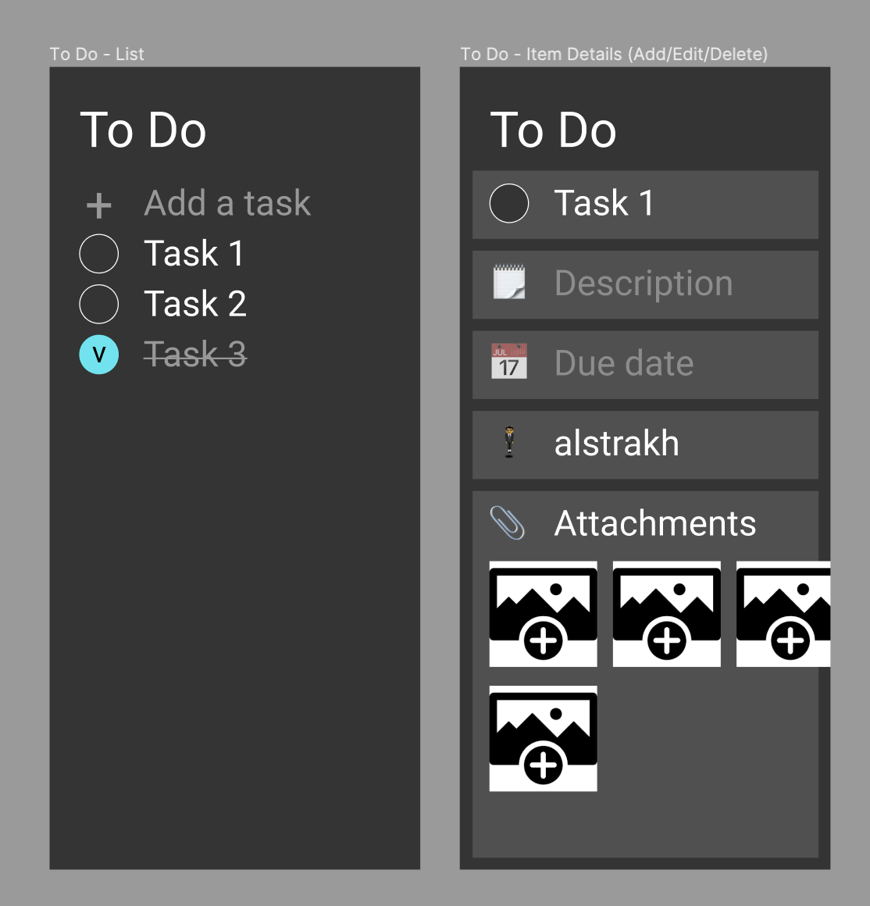

# Teams ToDo App

## Summary

This repository contains a simple ToDo app for Microsoft Teams built with the latest [TeamFx toolkit](https://docs.microsoft.com/en-us/javascript/api/@microsoft/teamsfx/?view=msteams-client-js-latest). This is a Tab app build with React and Northstar controls. Main features:

1. ToDo items list with ability to add, remove, edit items
1. Local storage for persistance
1. Graph API user search and custom queries
1. Azure function calls

## Demo

TBD

## Figma Design

Build to reflect the Figma design which can be found [here](https://www.figma.com/file/UHHwGcx8YG30LO6fp5gY21/TODO-App) and quick prototype is below

